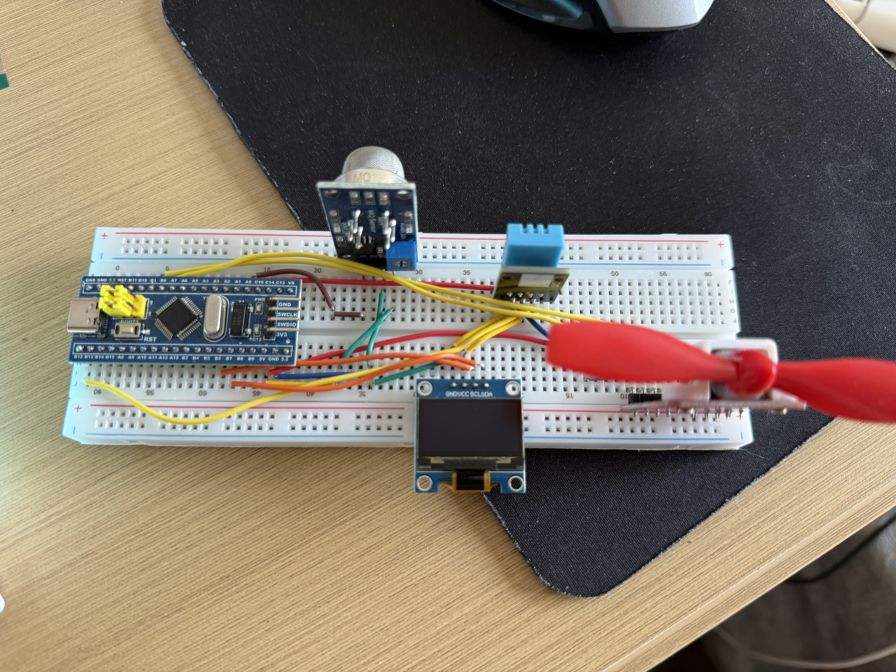

# 基于 STM32F103 的衣柜环境监测与自动通风控制系统

> **教学原型 / 历史项目。** 使用 DHT11 读取温湿度、读取 MQ135 模块的原始 ADC 值、在 OLED 和 USART1 输出状态，并以带滞回的阈值逻辑形成通风控制意图。它不是空气质量仪、气体浓度仪、自动家电、量产设备或当前已真机复测的产品。

## 历史素材证据（2026-07-18 发布）

已脱敏的历史照片。日期、脱敏处理、未公开材料和证据边界见 [MEDIA_EVIDENCE](docs/MEDIA_EVIDENCE.md)。



历史照片、截图或 EDA 不证明当前公开提交已烧录或完成真机复测。**当前未进行真机复测。**

## 当前状态与证据边界

| 层级 | 当前事实 |
| :-- | :-- |
| 源码来源 | 已确认：历史 Keil 工程保持只读；只迁移原创应用逻辑，不公开本机构建物、IDE 状态或许可证不完整的旧 CMSIS/启动文件。 |
| 公开适配 | 固定 PlatformIO STM32Cube 构建；来源不明的完整 OLED 字体替换为本仓最小字形；修正 DHT11 位宽判定、ADC 软件触发、日志语义和 `hold` 显示分支。 |
| 安全默认 | `ENABLE_FAN_OUTPUT=0`、`ENABLE_STARTUP_FAN_TEST=0`；默认不把 PB0/PB1 配置为输出，也不执行历史启动风扇测试。 |
| 构建 | 固定 PlatformIO Core `6.1.19` 与 `ststm32@19.5.0`，默认及风扇精确 opt-in 两条路径由无硬件门禁编译。 |
| 当前真机复测 | **未执行。** 当前公开候选没有重新烧录，也没有联调 STM32、DHT11、MQ135、OLED、UART、驱动级或风扇。 |
| 媒体与 EDA | 当前没有公开实物照片、演示视频、原理图、PCB、Gerber 或制造文件。 |

当前只确认**来源边界、公开文件、源码契约与隔离构建**。构建通过不能证明读数准确、OLED 点亮、风扇动作、接线正确、供电安全或系统稳定。

## 功能

- DHT11 温度、湿度和校验和读取；
- PA0 / ADC1 通道 0 的 16 次原始采样平均；
- 128 × 64 OLED 的温湿度、MQ 原始值、演示指数和控制意图显示；
- USART1 115200 baud 文本日志；
- 湿度与 MQ 原始 ADC 值的开启/关闭滞回阈值；
- PC13 调试 LED；
- 默认关闭的 PB0/PB1 风扇驱动候选接口。

## 重要语义

`demo_index = mq_raw × 100 / 4095` 只是便于显示的**未标定 ADC 演示指数**，不是百分比空气质量，也不是甲醛、CO₂、烟雾、污染物或任何气体浓度。MQ135 的响应受模块电路、预热、温湿度、老化、负载电阻、供电和目标气体影响；本仓没有标定曲线、参考仪器或准确度证据。

控制阈值 `2300 / 2000` 只来自历史源码，是教学参数，不是健康、安全或环境标准。

## 源码接口

| 功能 | 当前公开默认 |
| :-- | :-- |
| 主控目标 | STM32F103C8，PlatformIO `genericSTM32F103C8` |
| DHT11 DATA | PB12 |
| MQ 模拟输入 | PA0 / ADC1 通道 0；原始 12 位 ADC 采样 |
| OLED | PB6 SCL、PB7 SDA；软件 I²C；8 位写地址默认 `0x78`，即常见 7 位 `0x3C` |
| USART1 | PA9 TX、PA10 RX；115200 baud；固件只发送日志 |
| 调试 LED | PC13，低电平点亮 |
| 风扇驱动候选 | PB0 / PB1；公开默认保持未配置，不直接连接电机 |
| 湿度滞回 | 开启意图 `>= 75%RH`；关闭条件 `<= 70%RH` |
| MQ 原始值滞回 | 开启意图 `>= 2300`；关闭条件 `<= 2000` |

这些是源码接口，不是实物接线或原理图。通电前必须阅读 [HARDWARE.md](HARDWARE.md) 与[接线边界](hardware/wiring.md)，按手中精确模块核对电压、电流、上拉、驱动和保护。

## 构建与公开门禁

```bash
bash scripts/verify.sh
```

门禁在临时副本中执行敏感信息/路径/生成物扫描、精确公开源文件清单、仓库结构检查、源码契约测试、默认构建和风扇 opt-in **编译覆盖**。它不会访问原工程、烧录设备、打开串口或控制真实风扇。

单独构建公开默认：

```bash
pio run -e safe-default
```

`fan-output-opt-in` 仅用于 CI 编译覆盖。只有在确认精确低压驱动器、风扇、电源、反向保护、默认电平和断电接线后，才可自行构建；不要把未经审查的 opt-in 固件直接烧录到已接负载的板卡。

## 当前限制

- 当前提交没有与精确硬件绑定的烧录和端到端复测；
- DHT11 的时序修正只有源码与编译证据，尚未用逻辑分析仪或当前实物验证；
- OLED 地址探测、显示方向、模块供电和上拉未复测；
- MQ135 没有预热记录、模块型号、分压确认、标定、补偿或参考仪器对照；
- 默认控制逻辑仍计算风扇意图，但 `fan_set()` 在安全默认中保持输出关闭，主循环通过 `fan_get()` 回读驱动层状态，因此日志和 OLED 保持 `Fan:OFF`；
- 主循环与软件 I²C/DHT11/ADC 读取均为阻塞式，不适合安全关键或实时控制；
- 没有看门狗、故障锁存、风扇转速反馈、过流/过温保护或传感器合理性诊断；
- 本项目不得用于医疗、消防、安全告警、室内空气质量合规、生产环境或无人值守控制。

## 许可证与第三方

- Rongyi 原创的公开应用代码、最小字形、文档、脚本和接口图使用 [MIT License](LICENSE)；
- STM32CubeF1、CMSIS、GNU Arm 工具链和 PlatformIO 在构建时独立下载，受各自条款约束，见 [THIRD_PARTY_NOTICES.md](THIRD_PARTY_NOTICES.md)；
- 未复制历史 Keil 构建输出、旧 CMSIS/设备头、启动文件或来源不明的完整 OLED 字体；
- 欢迎用于学习和二次开发，但不要把本仓或文档原样冒充个人课程设计、毕业设计、竞赛或商业产品成果。

## 更多资料

- [硬件与电气边界](HARDWARE.md)
- [BOM](hardware/BOM.csv)
- [接线边界说明](hardware/wiring.md)
- [来源与公开适配](docs/SOURCE_PROVENANCE.md)
- [项目状态](docs/PROJECT_STATUS.md)
- [验证说明](docs/VERIFICATION.md)
- [安全说明](SECURITY.md)
- [Hardware Lab](https://github.com/rongyishuaige7/hardware-lab)
